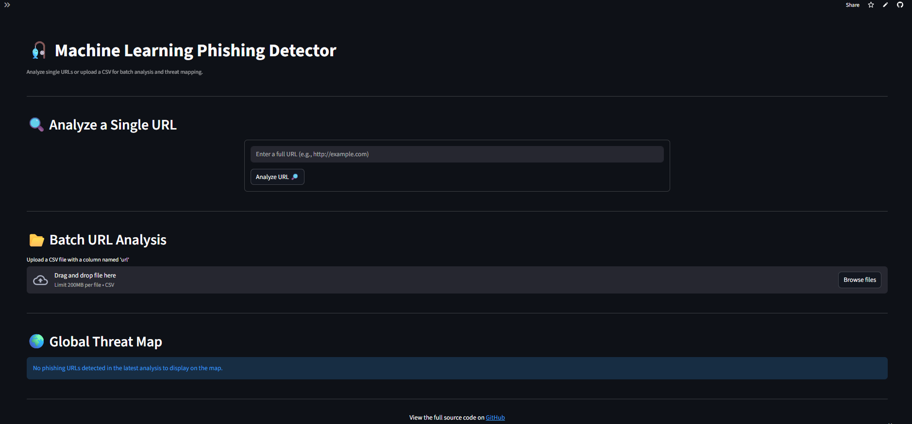

# 🎣 Phishing Detector ML Tool

_Created by [farixzz](https://farixzz.github.io)_

### 🚀 Live Demo

**[Click here to try the live application!](https://phishing-detector-ml.streamlit.app/)** 

---

 ## 🖼️ Application Preview




This is a production-grade security tool that leverages a state-of-the-art machine learning pipeline and real-time threat intelligence to detect phishing URLs. The project features a dual interface: a user-friendly web GUI for interactive analysis and a powerful CLI for automation and batch processing.

---

## ✨ Key Features

-   **📊 Batch Analysis & Threat Mapping (GUI):**
    -   Upload a CSV file containing hundreds of URLs for efficient batch processing.
    -   Visualize the geographic locations of detected phishing domains on an interactive **Global Threat Map**.
    -   Download the complete analysis results as a CSV file.

-   **🧠 Production-Grade Machine Learning Model:**
    -   A sophisticated pipeline combining a **TF-IDF Vectorizer** with a powerful **LightGBM** classifier, trained on a massive dataset of over 500,000 verified URLs.
    -   **Data-Driven Auto-Thresholding:** The detection threshold isn't a guess. It's automatically calculated using ROC curve analysis during each training cycle to maintain a security-first posture (optimized for >= 95% recall).

-   **🚩 Explainable AI (XAI):**
    -   When a phishing URL is detected, the tool provides a list of "Potential Red Flags" (e.g., presence of suspicious keywords, use of an IP address), explaining *why* a URL was flagged.

-   **📡 Real-Time API Intelligence:**
    -   Enhances ML predictions by cross-referencing URLs with the **VirusTotal** API, leveraging data from over 70 security vendors.

-   **🖥️ Dual Interface for All Users:**
    -   **Graphical User Interface (GUI):** An intuitive and polished web application built with Streamlit.
    -   **Powerful Command-Line Interface (CLI):** A feature-rich CLI for scripting, automation, and integration, supporting JSON and CSV output.

-   **🚨 Enterprise-Grade Alerting:**
    -   Includes a **SIEM integration** feature that can send high-confidence alerts in the standard Common Event Format (CEF), allowing it to plug into a professional Security Operations Center (SOC).

---

## 🛠️ Technology Stack

-   **Backend & ML:** Python, Scikit-learn, LightGBM, Pandas, Joblib
-   **GUI:** Streamlit
-   **CLI:** Click
-   **Visualization:** Folium, Streamlit-Folium
-   **APIs & Data:** Requests, tldextract
-   **Packaging:** PyInstaller
-   **Version Control:** Git, Git LFS

---

## 🚀 Setup and Installation

1.  **Clone this repository:**
    ```bash
    # Replace the URL with your repository's URL from GitHub
    git clone https://github.com/farixzz/phishing-detector-ml.git
    cd phishing-detector-ml
    ```

2.  **Set up the environment:**
    ```bash
    python3 -m venv venv
    # On Windows: venv\Scripts\activate
    # On Linux/macOS: source venv/bin/activate
    ```

3.  **Install dependencies:**
    ```bash
    pip install -r requirements.txt
    ```

4.  **Configure API Keys:**
    -   Create a copy of `config.py.template` and rename it to `config.py`.
    -   Open `config.py` and add your free API key from **VirusTotal**.

---

## 💻 How to Use

1. **Graphical User Interface (GUI)**

- Launch the Streamlit web application for the most user-friendly experience.

```bash
streamlit run app.py
```

2. **Command-Line Interface (CLI)**

- The CLI is ideal for automation and batch processing.

```bash
python main.py --url "https://www.example.com"
```

- Analyze URLs from a File and Save Results

```bash
python main.py --input-file urls.txt --output-file results.csv
```
- Get JSON Output for Scripting

```bash
python main.py --url "http://suspicious-site.com" --json-output
```


---


**📂 Project Structure**
```bash
phishing-detector-ml/
├── data/               # Raw datasets used for aggregation
├── models/             # Trained .joblib model (tracked with Git LFS)
├── .gitignore          # Git ignore rules (data/, config.py, etc.)
├── README.md           # Project documentation
├── aggregate_data.py   # Dataset aggregation & cleaning
├── api_checker.py      # VirusTotal API integration
├── app.py              # Streamlit GUI application
├── config.py.template  # Template for local API keys
├── detector.py         # Core analysis & prediction logic
├── geo_utils.py        # Threat map geolocation helper
├── main.py             # CLI entry point
├── requirements.txt    # Minimal, cloud-safe dependencies
├── siem_alerter.py     # CEF-based SIEM alert generator
├── train_model.py      # Model training with auto-threshold tuning
├── ui_helpers.py       # Explainability (Red Flags) logic
└── url_normalizer.py   # URL normalization & preprocessing
```

**📄 License**

- This project is released for educational and research purposes.
-Please use it responsibly and ethically.

**⭐ Author**

*farixzz*

- 🔗 Portfolio: https://farixzz.github.io

- 🐙 GitHub: https://github.com/farixzz

*If you found this project useful, feel free to ⭐ the repository!*